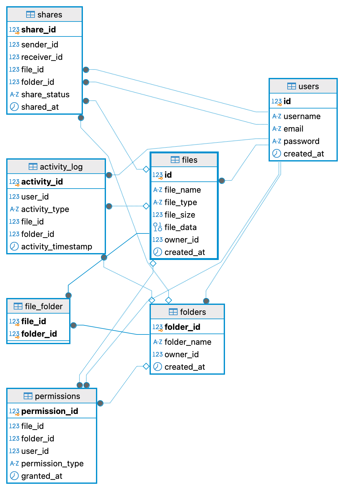

# Content
- [Task 1 - SpringJDBC-based Social Network](#task-1---springjdbc-based-social-network)
- [Task 2 - Highload Writing Console Tool](#task-2---highload-writing-console-tool)
- [Task 5 - Stored Procedure](#task-5---stored-procedure)
- [Task 7 - File Sharing](#task-7---file-sharing)
 
## Task 1 - SpringJDBC-based Social Network
### Database Configuration

The default configured database is H2, which requires no further adjustments.

### Run the Application

Execute the following commands to create the database schema, populate some data, and generate a report in the console:

```bash
cd task01
mvn clean install
mvn spring-boot:run
```

## Task 2 - Highload Writing Console Tool
### Database Configuration

The default database is PostgreSQL with the `dev` profile. Navigate to the following file to view or modify the configuration:

```bash
task02/src/main/resources/application-dev.properties
```

Please ensure to create the database named `module26_task02`.

### Application Configuration

The application's configuration is managed via a JSON file located at:

```
task02/config.json
```

The JSON schema is as follows:

```json
{
  "$schema": "http://json-schema.org/draft-07/schema#",
  "type": "object",
  "properties": {
    "concurrency": {
      "type": "integer",
      "minimum": 1
    },
    "tableConfigList": {
      "type": "array",
      "items": {
        "type": "object",
        "properties": {
          "columnCount": {
            "type": "integer",
            "minimum": 1
          },
          "typeCount": {
            "type": "integer",
            "minimum": 1
          },
          "rowCount": {
            "type": "integer",
            "minimum": 1
          }
        },
        "required": ["columnCount", "typeCount", "rowCount"]
      }
    }
  },
  "required": ["concurrency", "tableConfigList"]
}
```

`concurrency`: Specifies the number of threads to utilize, denoted as (L). This setting controls the parallelism level for operations that can be executed concurrently.

`tableConfigList`: Represents a user-defined array of size (N), where each element in the array corresponds to the configuration for one of (N) tables to be created. Each configuration item details:

- The number of columns (K) to be created in the table.
- The number of distinct data types (Z) to be used in these columns, with a current maximum of 14 distinct types.
- The total number of rows (m) to populate in the table.

This structure allows users to define multiple table configurations, each specifying the schema and size of the table, which can be processed using the specified level of concurrency.


### Run the application
```bash
cd task02
mvn clean install
mvn spring-boot:run
```

## Task 5 - Stored Procedure
### Database Configuration

The default configured database is PostgreSQL. Please create the database named `module26_task05` and update the credentials in the `application.properties`

Modify the `run_sql_scripts.sh` file to update the database configuration and credentiasls. Then execute it to seed the database:

```bash
cd task05
sh run_sql_scripts.sh
```

### Run the Application

Execute the following commands to start the application:

```bash
cd task05
mvn clean install
mvn spring-boot:run
```

## Task 7 - File Sharing
### Database Configuration

The default configured database is PostgreSQL. Please create the database named `module26_task07` and update the credentials in the `application.properties`

### Run the Application

Execute the following commands to create the database schema, populate some data, and start the application:

```bash
cd task07
mvn clean install
java -jar target/task07-1.0.0.jar file.txt 
```

To upload a local file, use:

```
java -jar target/task07-1.0.0.jar path/to/your/file
```

The schema created is displayed in the following diagram: 
